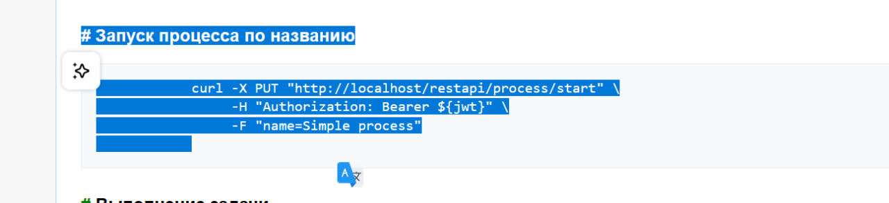
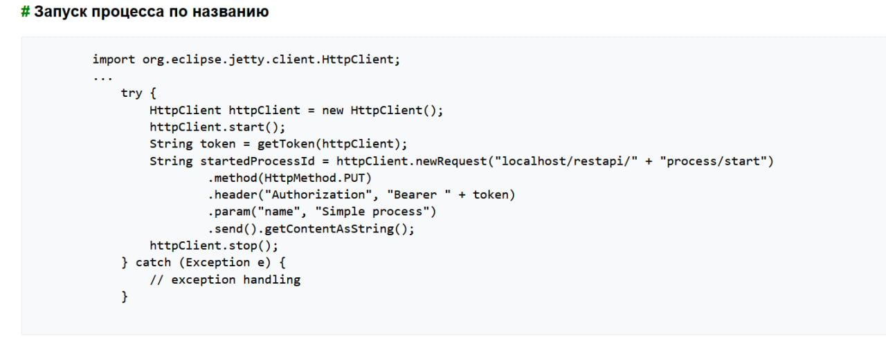
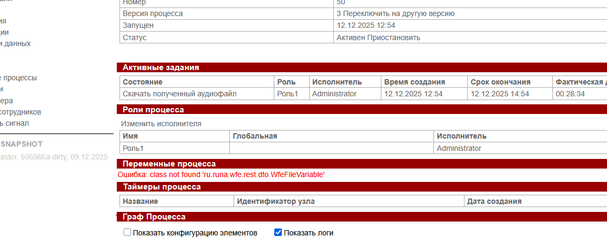
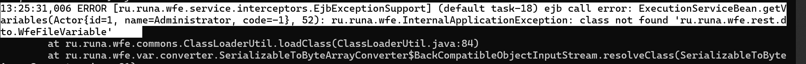

https://runawfe.ru/RestApiDeveloperGuide

тут name передается параметр в строку запроса (URL),

-F указывает на отправку multipart/form-data

 
* Не принимает чистый json - требует WfeFileVariable 

* - где скачать
<dependency>
<groupId>ru.runa.wfe</groupId>
<artifactId>wfe-restapi</artifactId>
<classifier>client</classifier>
</dependency>
// public class ForDraft  - пробывал передавать файл при закрытие тоже не работает 

* В документации
Базовый урл - /task (например, для localhost - localhost/restapi/task)

Отвечает за работу с задачами, основные методы:
/my - получение собственных задач (пользователя, JWT которого передается в Authorization) — не работает     @PostMapping("my")
* В коде
  
  public WfePagedList<WfeTask> getMyTasks(@AuthenticationPrincipal AuthUser authUser, @RequestBody WfePagedListFilter filter) {
        List<WfTask> tasks = taskLogic.getMyTasks(authUser.getUser(), filter.toBatchPresentation(ClassPresentationType.TASK));
        return new WfePagedList<>(tasks.size(), Mappers.getMapper(WfeTaskMapper.class).map(tasks));
    }